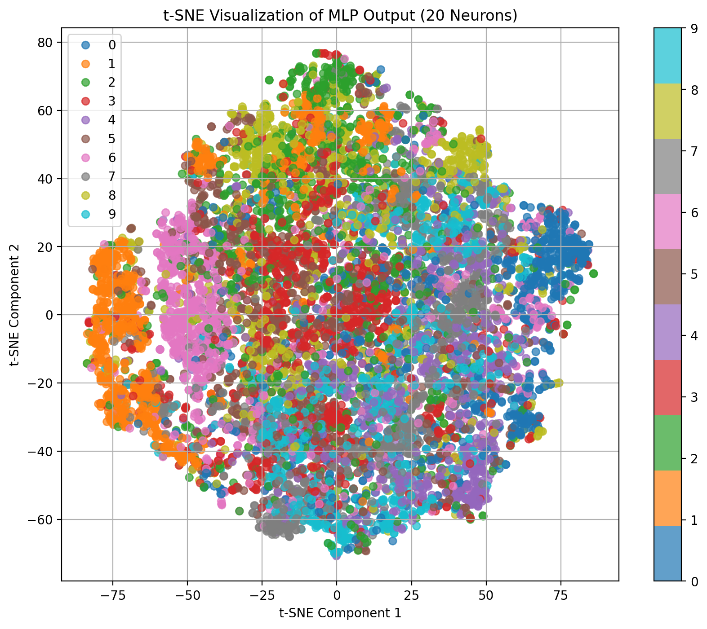
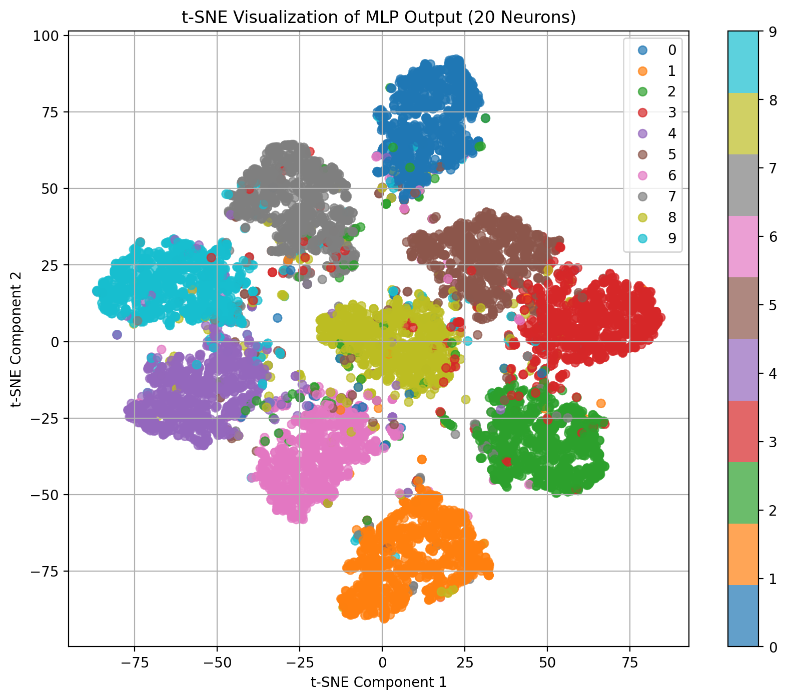
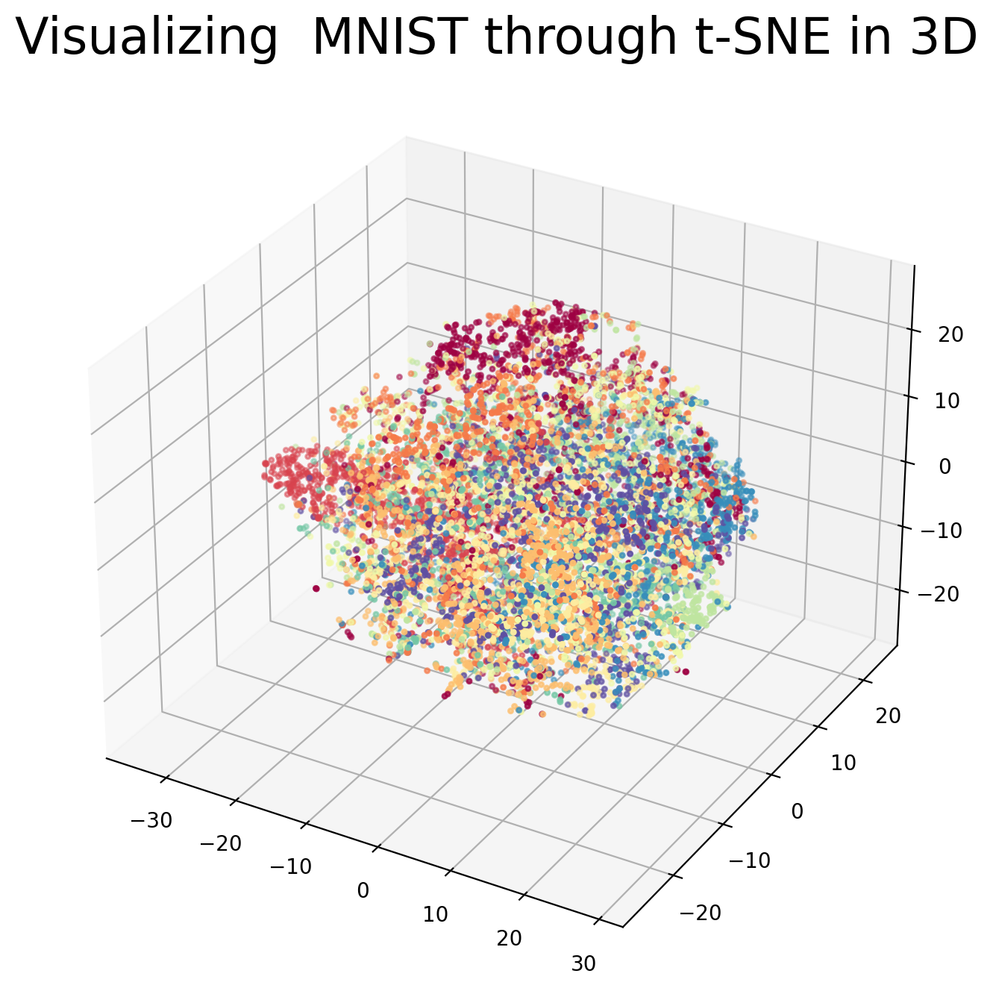
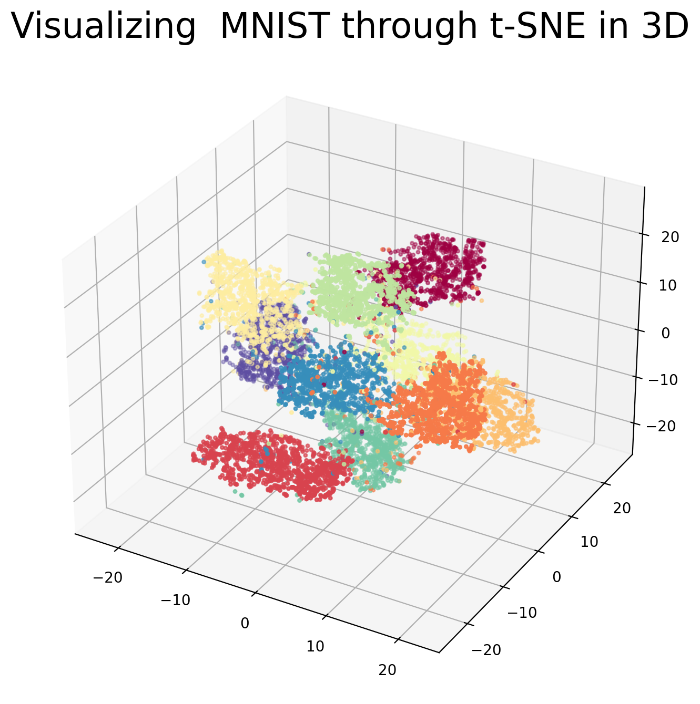
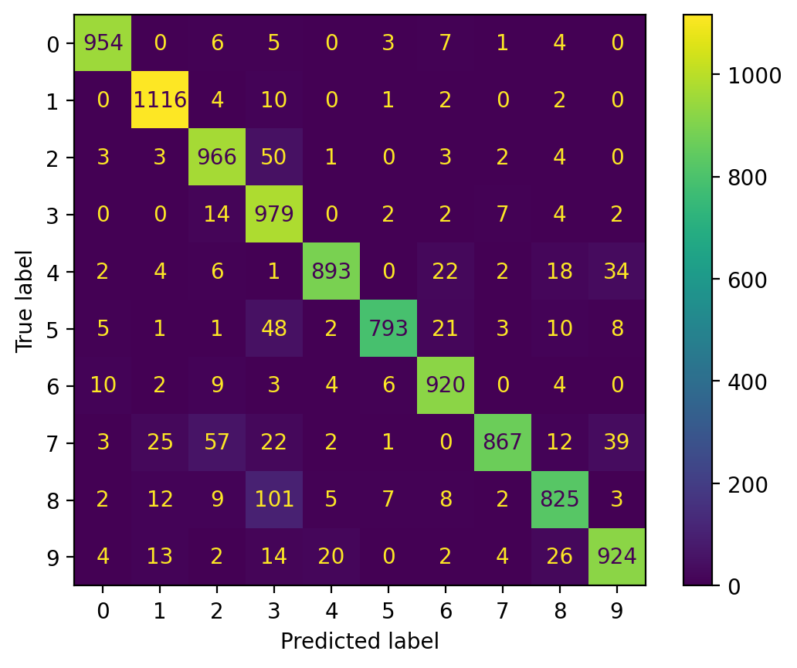
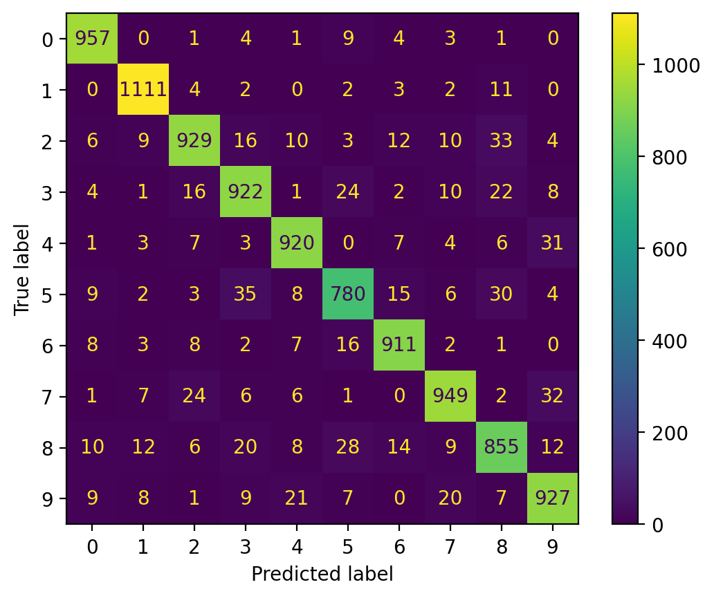
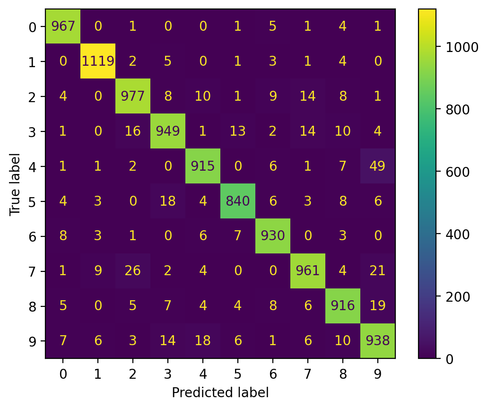
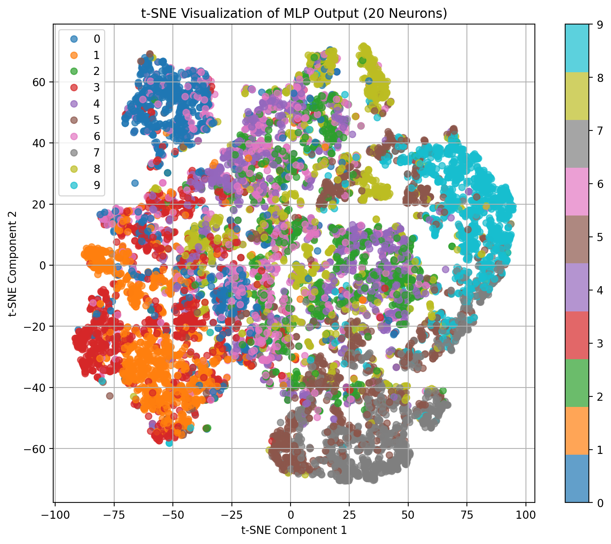
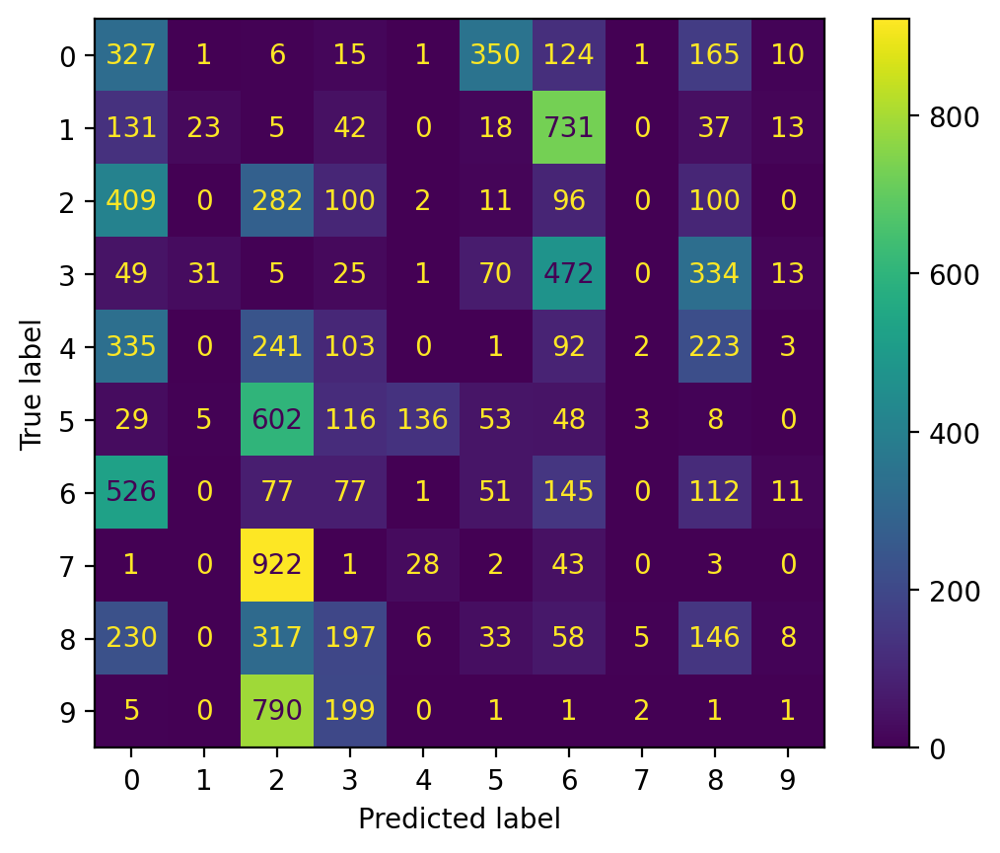

### Multi-Layer Perceptron

##### Before:
**Accuracy score:** 11.42%
It is obvious that the accuracy before fitting the model would be vey low. This is because the weights of the MLP are assigned randomly.

##### After:
**Accuracy score:** 93.84%

The NN has been trained for 1 epoch for all the 60000 examples. The loss at the end comes out to be 1.4612.

|                                   |                                   |
|               -                   |                   -               |
|Before training                    | After Training
|     |      |
|   |    |

The TSNE plot at the begining is concentrated at the center. After the training process different clusters could be seen. Also, few of the points are misclassified.

### Multi-Layer Perceptron
**f1 score:** 0.93809
**Precision score:** 0.9396
**Recall score:** 0.9384
**Accuracy:** 0.9384

The MLP is mostly confused between the the digit 8(true label) and the digit 3(predicted label). It has misclassfied it 101 times. It is also confused between 7(true) and 2(predicted), 5(true) and 3(predicted), 7(true) and 9(predicted). 

### Multi-Class Logistic Regression
**f1 score:** 0.9259341439061143
**Precision score:** 0.9278117816042404
**Recall score:** 0.9237
**Accuracy:** 0.9261

The multiclass logistic regression did same as the MLP. The only difference is that instead of confusing too many times between 2 digits, it misclassified nearly all the digits leading to a similar accuracy score, f1 score, and so on.

### Random Forest
**f1 score:** 0.9511921626652323recall:
**Precision:** 0.9278117816042404
**Recall:** 0.9237
**Accuracy:** 0.9512

Random forest did the best. It obtained a accuracy of 95% with a f1 score of 0.95. In order to select the best hyperparameters nested cross vadidation was done on the depth and criterion, which pointed depth of 10 and criterion of entropy would be the best.

In all the above confusion matrix it can be seen that the models did well in classifying the input images to one of the 10 classes. Although, in comparison with the the correctly classified output the incorrect ones are in less number. Thus, the precision and recall are nearly same.

### Fashion MNIST 

**f1 score:** 0.07267643354168535
**accuracy:** 10.02%

The fashion MNIST has 28*28 grayscale images, containing 10 classes corresponding to T-shirt, sandal, bag, and so on. Therefore, the trained MLP on MNIST dataset can't do well on fashion MNIST due to more number of features present in the images. In order to do well one of the approch could be to increase the number of hidden layer and the number of neurons.

|                                            |                                       |
|                        -                   |                       -               |
| |      |

In the above figure one clusters could be spotted at the top left corner which is class 0. Therefore, it resulted in correct classification. The same can be observed in the confusion matrix. Comparing this TSNE plot with the one of MNIST, it can be seen that in case of MNIST dataset proper clusters are formed for each of the classes with very few errors.